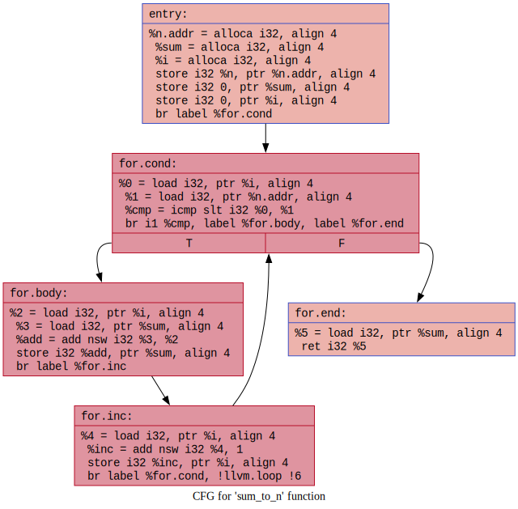
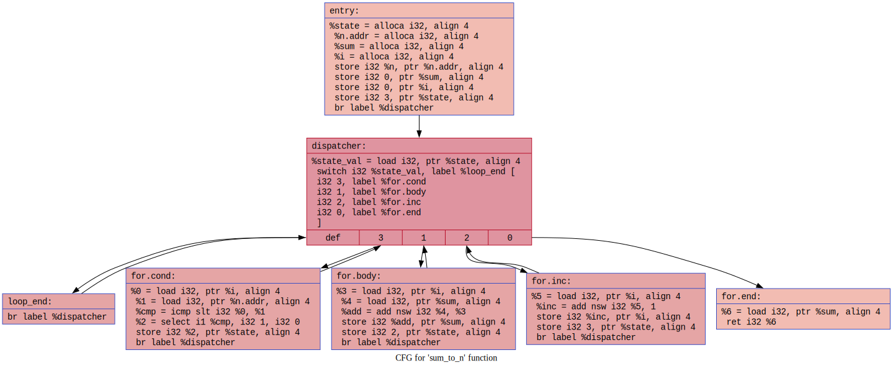

# CFG flattening

An LLVM pass that flattens the CFG (Control Flow Graph). The normal control flow of a function is transformed into a single loop with a switch-case dispatcher. All basic blocks are placed inside the loop and a state variable determines which block executes next. Block IDs are randomized for additional obfuscation.

Known limitations:
- slightly increased code size
- slightly increased runtime penalty

Currently supported:
- Entry blocks with unconditional branches.
- Unconditional branches between non-entry blocks.
- Conditional branches between non-entry blocks.

Not yet supported:
- Entry blocks with conditional branches.
- Entry blocks with switch instructions.
- Switch instructions in non-entry blocks.


The source code is available [here](https://github.com/gemesa/phantom-pass/tree/main/src/15-cfg-flattening).

Generate the IR for our `main()` test code:

> Note: we do not optimize the generated IR in this case before applying our obfuscation pass. The reason is that the obfuscation pass only supports entry blocks with unconditional branches. After optimization, the unconditional branches might get replaced with conditional ones when compiling the test code.

```
$ clang test.c -O0 -Xclang -disable-O0-optnone -S -emit-llvm -o test.ll
```

Check the output:

```
$ cat test.ll
; ModuleID = 'test.c'
source_filename = "test.c"
target datalayout = "e-m:e-p270:32:32-p271:32:32-p272:64:64-i64:64-i128:128-f80:128-n8:16:32:64-S128"
target triple = "x86_64-unknown-linux-gnu"

@.str = private unnamed_addr constant [12 x i8] c"result: %d\0A\00", align 1

; Function Attrs: noinline nounwind uwtable
define dso_local i32 @sum_to_n(i32 noundef %n) #0 {
entry:
  %n.addr = alloca i32, align 4
  %sum = alloca i32, align 4
  %i = alloca i32, align 4
  store i32 %n, ptr %n.addr, align 4
  store i32 0, ptr %sum, align 4
  store i32 0, ptr %i, align 4
  br label %for.cond

for.cond:                                         ; preds = %for.inc, %entry
  %0 = load i32, ptr %i, align 4
  %1 = load i32, ptr %n.addr, align 4
  %cmp = icmp slt i32 %0, %1
  br i1 %cmp, label %for.body, label %for.end

for.body:                                         ; preds = %for.cond
  %2 = load i32, ptr %i, align 4
  %3 = load i32, ptr %sum, align 4
  %add = add nsw i32 %3, %2
  store i32 %add, ptr %sum, align 4
  br label %for.inc

for.inc:                                          ; preds = %for.body
  %4 = load i32, ptr %i, align 4
  %inc = add nsw i32 %4, 1
  store i32 %inc, ptr %i, align 4
  br label %for.cond, !llvm.loop !6

for.end:                                          ; preds = %for.cond
  %5 = load i32, ptr %sum, align 4
  ret i32 %5
}

; Function Attrs: noinline nounwind uwtable
define dso_local i32 @main() #0 {
entry:
  %retval = alloca i32, align 4
  %val = alloca i32, align 4
  store i32 0, ptr %retval, align 4
  %call = call i32 @sum_to_n(i32 noundef 10)
  store i32 %call, ptr %val, align 4
  %0 = load i32, ptr %val, align 4
  %call1 = call i32 (ptr, ...) @printf(ptr noundef @.str, i32 noundef %0)
  ret i32 0
}

declare i32 @printf(ptr noundef, ...) #1

attributes #0 = { noinline nounwind uwtable "frame-pointer"="all" "min-legal-vector-width"="0" "no-trapping-math"="true" "stack-protector-buffer-size"="8" "target-cpu"="x86-64" "target-features"="+cmov,+cx8,+fxsr,+mmx,+sse,+sse2,+x87" "tune-cpu"="generic" }
attributes #1 = { "frame-pointer"="all" "no-trapping-math"="true" "stack-protector-buffer-size"="8" "target-cpu"="x86-64" "target-features"="+cmov,+cx8,+fxsr,+mmx,+sse,+sse2,+x87" "tune-cpu"="generic" }

!llvm.module.flags = !{!0, !1, !2, !3, !4}
!llvm.ident = !{!5}

!0 = !{i32 1, !"wchar_size", i32 4}
!1 = !{i32 8, !"PIC Level", i32 2}
!2 = !{i32 7, !"PIE Level", i32 2}
!3 = !{i32 7, !"uwtable", i32 2}
!4 = !{i32 7, !"frame-pointer", i32 2}
!5 = !{!"clang version 22.0.0git (git@github.com:llvm/llvm-project.git ab665f217ac573c473266a2b188b1f5a0eaa946e)"}
!6 = distinct !{!6, !7}
!7 = !{!"llvm.loop.mustprogress"}
```

Run the pass:

```
$ opt -load-pass-plugin=./obf.dylib -passes="flatten-cfg<sum_to_n>" -S test.ll -o obf.ll
Dispatcher:
  Block 'for.cond' assigned ID: 3
  Block 'for.body' assigned ID: 2
  Block 'for.inc' assigned ID: 0
  Block 'for.end' assigned ID: 1
FlattenCfgPass: CFG flattened in function 'sum_to_n'
```

Check the output, note that the basic block terminators are replaced with dispatcher logic:

```
$ cat obf.ll
; ModuleID = 'test.ll'
source_filename = "test.c"
target datalayout = "e-m:e-p270:32:32-p271:32:32-p272:64:64-i64:64-i128:128-f80:128-n8:16:32:64-S128"
target triple = "x86_64-unknown-linux-gnu"

@.str = private unnamed_addr constant [12 x i8] c"result: %d\0A\00", align 1

; Function Attrs: noinline nounwind uwtable
define dso_local i32 @sum_to_n(i32 noundef %n) #0 {
entry:
  %state = alloca i32, align 4
  %n.addr = alloca i32, align 4
  %sum = alloca i32, align 4
  %i = alloca i32, align 4
  store i32 %n, ptr %n.addr, align 4
  store i32 0, ptr %sum, align 4
  store i32 0, ptr %i, align 4
  store i32 3, ptr %state, align 4
  br label %dispatcher

for.cond:                                         ; preds = %dispatcher
  %0 = load i32, ptr %i, align 4
  %1 = load i32, ptr %n.addr, align 4
  %cmp = icmp slt i32 %0, %1
  %2 = select i1 %cmp, i32 2, i32 1
  store i32 %2, ptr %state, align 4
  br label %dispatcher

for.body:                                         ; preds = %dispatcher
  %3 = load i32, ptr %i, align 4
  %4 = load i32, ptr %sum, align 4
  %add = add nsw i32 %4, %3
  store i32 %add, ptr %sum, align 4
  store i32 0, ptr %state, align 4
  br label %dispatcher

for.inc:                                          ; preds = %dispatcher
  %5 = load i32, ptr %i, align 4
  %inc = add nsw i32 %5, 1
  store i32 %inc, ptr %i, align 4
  store i32 3, ptr %state, align 4
  br label %dispatcher

for.end:                                          ; preds = %dispatcher
  %6 = load i32, ptr %sum, align 4
  ret i32 %6

dispatcher:                                       ; preds = %for.inc, %for.body, %for.cond, %entry, %loop_end
  %state_val = load i32, ptr %state, align 4
  switch i32 %state_val, label %loop_end [
    i32 3, label %for.cond
    i32 2, label %for.body
    i32 0, label %for.inc
    i32 1, label %for.end
  ]

loop_end:                                         ; preds = %dispatcher
  br label %dispatcher
}

; Function Attrs: noinline nounwind uwtable
define dso_local i32 @main() #0 {
entry:
  %retval = alloca i32, align 4
  %val = alloca i32, align 4
  store i32 0, ptr %retval, align 4
  %call = call i32 @sum_to_n(i32 noundef 10)
  store i32 %call, ptr %val, align 4
  %0 = load i32, ptr %val, align 4
  %call1 = call i32 (ptr, ...) @printf(ptr noundef @.str, i32 noundef %0)
  ret i32 0
}

declare i32 @printf(ptr noundef, ...) #1

attributes #0 = { noinline nounwind uwtable "frame-pointer"="all" "min-legal-vector-width"="0" "no-trapping-math"="true" "stack-protector-buffer-size"="8" "target-cpu"="x86-64" "target-features"="+cmov,+cx8,+fxsr,+mmx,+sse,+sse2,+x87" "tune-cpu"="generic" }
attributes #1 = { "frame-pointer"="all" "no-trapping-math"="true" "stack-protector-buffer-size"="8" "target-cpu"="x86-64" "target-features"="+cmov,+cx8,+fxsr,+mmx,+sse,+sse2,+x87" "tune-cpu"="generic" }

!llvm.module.flags = !{!0, !1, !2, !3, !4}
!llvm.ident = !{!5}

!0 = !{i32 1, !"wchar_size", i32 4}
!1 = !{i32 8, !"PIC Level", i32 2}
!2 = !{i32 7, !"PIE Level", i32 2}
!3 = !{i32 7, !"uwtable", i32 2}
!4 = !{i32 7, !"frame-pointer", i32 2}
!5 = !{!"clang version 22.0.0git (git@github.com:llvm/llvm-project.git ab665f217ac573c473266a2b188b1f5a0eaa946e)"}
```

**Graphs:**

> Note: the graphs are generated via the following commands
> `$ opt -passes=dot-cfg test.ll -disable-output`
> `$ dot -Tsvg .sum_to_n.dot -o 15-cfg-flattening-cfg-before.svg`
> `$ opt -passes=dot-cfg obf.ll -disable-output`
> `$ dot -Tsvg .sum_to_n.dot -o 15-cfg-flattening-cfg-after.svg`

Before:


After:



Build the modified IR and run the executable:

> Note: do not pass `-O3` or other optimization-related options at this point as they might interfere with the applied obfuscation methods.

```
$ clang obf.ll -o obf && ./obf
result: 45
```
